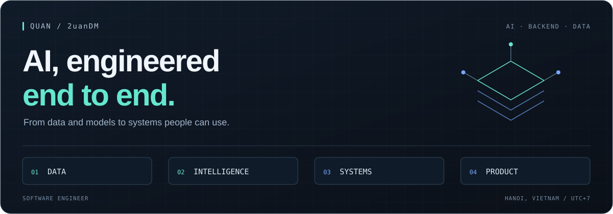

  

  <a href="https://quandm.dev"><strong>Portfolio ↗</strong></a> &nbsp;&nbsp; / &nbsp;&nbsp;
  <a href="https://www.linkedin.com/in/quan1005/"><strong>LinkedIn ↗</strong></a> &nbsp;&nbsp; / &nbsp;&nbsp;
  <a href="mailto:hust.quanduongminh@gmail.com"><strong>Let's talk ↗</strong></a>

### I'm Quan — a software engineer working across AI, backend & data.

My work spans conversational AI, data pipelines, and distributed computer vision. I'm interested in the whole path from a useful idea to a working product: how data arrives, how intelligence fits into the system, and how people interact with the result.

**Current focus:** end-to-end AI products, agentic applications, and the systems behind them.

 

## Selected work

<table>
<tr>
<td width="50%" valign="top">

#### 01 / Finbot
**Conversational AI · Retrieval**

A real-time RAG chatbot for finance, bringing retrieval and conversation into one application.

`Python` `RAG` `Qdrant` `Redis`

[Explore the team project ↗](https://github.com/datvodinh/finbot)

</td>
<td width="50%" valign="top">

#### 02 / Okini Data Platform
**Data engineering · Orchestration**

An ETL platform with scheduled crawlers and a containerized browser workflow for collecting data.

`Dagster` `Playwright` `Docker` `BigQuery`

[Explore the repository ↗](https://github.com/2uanDM/okini-data-platform)

</td>
</tr>
<tr>
<td width="50%" valign="top">

#### 03 / Person Re-Identification
**Computer vision · Distributed systems**

A person re-identification and tracking pipeline that distributes work between edge devices and a server.

`Python` `YOLOv10` `Kafka` `Redis`

[Explore the repository ↗](https://github.com/2uanDM/reid-pipeline)

</td>
<td width="50%" valign="top">

#### 04 / BeeHi · MBBank
**Conversational AI · Product experience**

A recruitment chatbot designed to help candidates discover suitable roles and navigate recruitment questions.

`AI assistant` `Recruitment`

[Visit the recruitment website ↗](https://careers.mbbank.com.vn/)

</td>
</tr>
</table>

 

## Across the stack

| Layer | Tools I work with |
| :--- | :--- |
| **AI & retrieval** | PyTorch · LLM applications · RAG · Elasticsearch |
| **Application** | Python · TypeScript · React |
| **Data** | PostgreSQL · MongoDB · BigQuery · Dagster |
| **Infrastructure** | Docker · Kubernetes · Kibana |

## How I approach a build

- **Start with the problem.** Define the user workflow and what a useful result looks like.
- **Think in systems.** Connect data, models, APIs, and interfaces; make the boundaries explicit.
- **Make quality measurable.** Treat evaluation, latency, failure handling, and observability as part of the design.
- **Close the loop.** Use feedback from the product to guide the next iteration.

 

---

**Have an AI product to build, or a systems problem to work through?** 
Open to collaboration and freelance projects. [Get in touch ↗](mailto:hust.quanduongminh@gmail.com)
